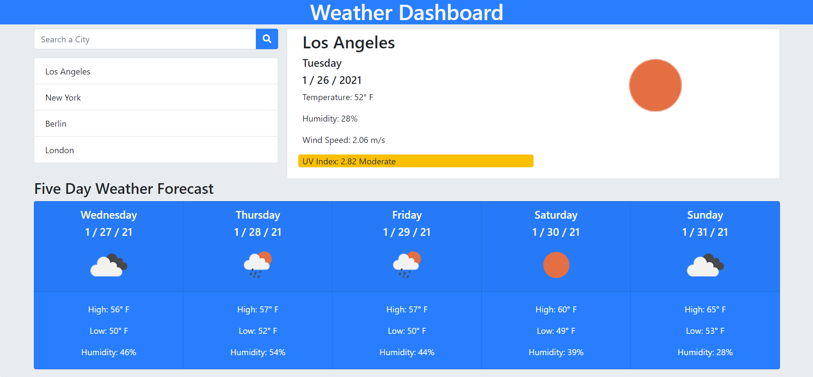

# weather_dashboard
API Weather application.

This weather application retrieves weather data from the [OpenWeather API](https://openweathermap.org/api) and displays it to the user. When the user enters a city in the input field and clicks the "Search" button, the application gets the API data for the searched city. 

The application displays the current and five day forecasts for the searched city. The current forecast includes the current temperature, humidity, wind speed and UV index. The UV index indicates whether conditions are favorable, moderate, or severe.

The application prepends the searched city to a list and stores it in local storage. When the application is run, the last searched city's forecast is displayed.

## Links

URL: https://spencercreer.github.io/weather_dashboard/

Repository: https://github.com/spencercreer/weather_dashboard 

## Images

The following image shows the application's appearance:

