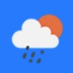

<p>

</p>

# Weather GraphQL


## Description
A React OpenWeather application.

This application retrieves weather data from the OpenWeather API and displays it to the user. It displays the current and 5-day forecasts for a searched city. The current forecast includes the current temperature, humidity, wind speed and UV index. The UV index indicates whether conditions are favorable, moderate, or severe.

The application prepends the searched city to a list and stores it in local storage. When the application is run, the last searched city's forecast is displayed.

## Table of Contents
* [Links](#links)
* [Animation](#animation) 
* [Instructions](#instructions)   
* [Technologies](#technologies) 
* [APIs](#apis) 
* [License](#license)
* [Contact](#contact)

## Links
Published URL: [https://explore-weather-graphql.herokuapp.com/](https://explore-weather-graphql.herokuapp.com/)<br>

Repository: [https://github.com/spencercreer/weather_graphql](https://github.com/spencercreer/weather_graphql)


## Animation
The following image demonstrates the application appearance:<br>


## Installation
This application utilizes the following [dependencies](#dependencies).

After cloning the repo locally, install the necessary dependencies by running the following command:

  ```
  npm install
  ```
<span style="color:green">Node v16.13.1 and npm v8.3.0</span>
 
## Dependencies

This application utilizes the following dependencies:

|Dependency        |Version    |
|------------------|-----------|
|axios             |0.24.0     |
|bootstrap         |5.1.3      |
|moment            |2.29.1     |
|react             |17.0.2     |
|react-bootstrap   |2.0.3      |

## Instructions
The user may search the weather of a city by entering the city name in the input element. A list of searched cities is created and the user may recall previously searched weather forecasts by clicking a list element.

## Contribute
Please submit a PR if you would like to contribute.

## Technologies
 * React
 * Bootstrap

## APIs
The application utilizes the following APIs:
  * [OpenWeather API](https://openweathermap.org/api)

## License
This project is licensed under the MIT license.

## Contact
For questions or comments, please contact me.

Email: <a href="mailto: spencercreer@gmail.com" target="_blank">spencercreer@gmail.com</a>

GitHub: [spencercreer](https://github.com/spencercreer/)
